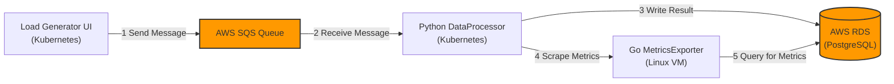
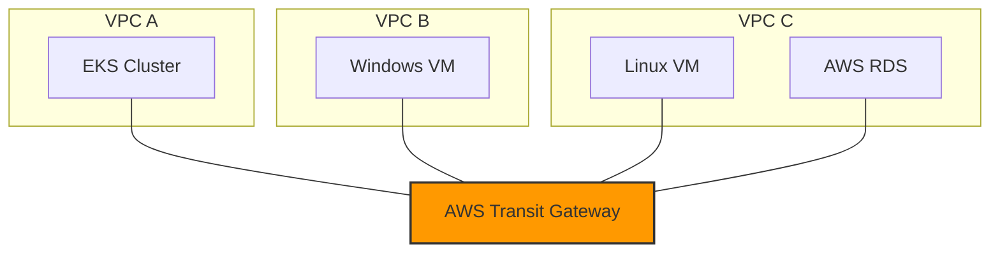

# Telemetry Hub Test Environment

## Table of Contents
- [Summary](#summary)
  - [Directory Structure](#directory-structure)
- [Architecture Diagram](#architecture-diagram)
  - [Application & Signal Flow](#application--signal-flow)
  - [Network Topology](#network-topology)
- [Deployment Steps](#deployment-steps)
- [Local Development](#local-development)
- [Environment Cleanup](#environment-cleanup)
- [Troubleshooting](#troubleshooting)

---

## Summary

The **Telemetry Hub** is a purpose-built, multi-component application stack designed to provide a comprehensive testbed for evaluating modern observability platforms. Its primary goal is to generate a rich variety of telemetry (MELT) across a realistic cloud architecture.

This environment allows you to test a vendor's ability to:
* Automatically instrument applications using OpenTelemetry.
* Discover and scrape Prometheus metrics from both Kubernetes and standalone hosts.
* Monitor network traffic across VPCs using eBPF.
* Integrate with managed AWS services like RDS and SQS.
* Provide a cohesive view of a distributed trace that spans multiple services, languages, and infrastructure types.

### Directory Structure

```
telemetry-hub/
├── .gitignore                  # Specifies intentionally untracked files to ignore.
├── README.md                   # This file.
│  
├── dev/                        # Resources for local, accelerated development.
│   ├── README.md                 # Instructions for the local dev environment.
│   ├── docker-compose.yml        # Runs a local PostgreSQL database for testing.
│   └── cloudformation-dev.yml    # A minimal CloudFormation stack for a dev RDS instance.
│
├── k8s/                        # Kubernetes manifests for all applications.
│   ├── python-processor/         # Manifests for the backend SQS processing service.
│   │   ├── deployment.yaml         # Defines the desired state for the processor Pods.
│   │   └── service.yaml            # Exposes the processor Pods as a network service within the cluster.
│   ├── load-generator/           # Manifests for the web UI and load generation service.
│   │   ├── deployment.yaml         # Defines the desired state for the load generator Pods.
│   │   └── service.yaml            # Exposes the load generator to the internet via a LoadBalancer.
│   └── deploy-k8s-apps.sh        # Script to deploy both apps to EKS.
│  
├── infrastructure/             # Infrastructure as Code (IaC) for AWS resources.
│   ├── cloudformation.yml        # CloudFormation template for VPCs, TGW, EC2, RDS, etc.
│   ├── deploy-infra.sh           # Shell script to automate the CloudFormation deployment.
│   └── deploy-eks.sh             # Shell script to automate the EKS cluster creation.
│  
└── src/                        # Source code for the test applications.
    ├── csharp-producer/          # .NET application that runs on the Windows VM.
    │   ├── package-and-upload.sh   # Packages and uploads the app to S3.
    │   ├── DataProducer.csproj     # C# project file defining dependencies (e.g., AWS SDK).
    │   └── Program.cs              # Main application logic for sending messages to SQS.
    │
    ├── go-exporter/              # Go application that runs on the Linux VM.
    │   ├── package-and-upload.sh   # Packages and uploads the app to S3.
    │   ├── exporter.go             # Main application logic for querying RDS and exposing metrics.
    │   └── go.mod                  # Go module file for managing project dependencies.
    │   └── go.sum                  # Go file for ensuring integrity of project dependencies.
    │
    ├── python-processor/         # Python backend service that runs in Kubernetes.
    │   ├── build-and-push.sh       # Script to build and push the container image to ECR.
    │   ├── Dockerfile              # Instructions to build the Python app into a container image.
    │   ├── requirements.txt        # Lists Python package dependencies.
    │   └── processor.py            # Main application logic for processing SQS messages.
    │  
    └── load-generator/           # Python web UI that runs in Kubernetes.
        ├── build-and-push.sh       # Script to build and push the container image to ECR.
        ├── Dockerfile              # Instructions to build the Python app into a container image.
        ├── requirements.txt        # Lists Python package dependencies.
        ├── load_generator.py       # Main application logic for the web UI and load generation.
        └── templates/              # Directory to hold web UI files.
            └── index.html            # HTML template for the web UI.
```

---

## Architecture Diagram

The architecture is broken into two views: the application and signal flow, and the underlying network topology.

### Application & Signal Flow

This diagram shows how the different application components communicate with each other and with AWS services to generate telemetry.



### Network Topology

This diagram shows how the three separate VPCs are interconnected using an AWS Transit Gateway to allow communication between the application components.



---

## Deployment Steps

This section describes the process for deploying the full, multi-component application stack to AWS. For a faster, iterative development workflow, see the [Local Development](#local-development) section below.

### 1. Prerequisites

Before deploying, ensure you have the following installed and configured on your local machine.

1.  **AWS Account:** An active AWS account with permissions to create the resources defined in the table above. Using an `AdministratorAccess` policy is the simplest approach for this test environment.
2.  **AWS CLI:** The AWS Command Line Interface must be installed and configured.
    * Run `aws configure` to set up your credentials and default region.
    * **Verification:** Verify your CLI configuration by running `aws sts get-caller-identity`. This should return your Account ID, User ID, and ARN without errors.
3.  **Session Manager Plugin:** The plugin for the AWS CLI is required for connecting to the EC2 instances.
    * Follow the [Official Installation Guide](https://docs.aws.amazon.com/systems-manager/latest/userguide/session-manager-working-with-install-plugin.html) for your operating system.
    * **Verification:** The plugin does not have a standalone version command. Its successful installation is verified when the `aws ssm start-session` command in the "Notes" section works without a "plugin not found" error.
4.  **Code Editor:** A code editor like VS Code is recommended for reviewing the project files.

#### Environment Variables

The deployment scripts can be run non-interactively by setting the following environment variables before execution.

**Local Machine (for deployment scripts):**
- `AWS_REGION`: The AWS region to deploy resources into (e.g., `us-east-1`).
- `AWS_ACCOUNT_ID`: Your 12-digit AWS Account ID.
- `DB_PASSWORD`: The master password for the RDS database.
- `USE_MY_IP`: Set to `true` to use your current public IP for security group rules.
- `GO_EXPORTER_URL`: The pre-signed S3 URL for the Go Exporter package.
- `CSHARP_PRODUCER_URL`: The pre-signed S3 URL for the C# Producer package.

**Remote Hosts (for application configuration):**
- `DB_HOST`: The RDS endpoint address.
- `DB_USER`: The username for the RDS database (`dbadmin`).
- `DB_NAME`: The name of the RDS database (`telemetryhubdb`).
- `DB_PASSWORD`: The master password for the RDS database.
- `SQS_QUEUE_URL`: The URL of the SQS queue.

### 2. Package and Upload Host Applications

The Go and C# applications are installed on the EC2 instances at boot time using pre-signed S3 URLs. You must run the packaging scripts first to generate these URLs.

1.  **Package the Go Exporter:**
    * Navigate to the `go-exporter` source directory.
        ```bash
        cd src/go-exporter
        ```
    * Make the script executable and run it.
        ```bash
        chmod +x package-and-upload.sh
        ./package-and-upload.sh
        ```
    * **Copy the pre-signed URL** that is printed at the end. You will need it for the next step.

2.  **Package the C# Producer:**
    * Navigate to the `csharp-producer` source directory.
        ```bash
        cd ../csharp-producer
        ```
    * Make the script executable and run it.
        ```bash
        chmod +x package-and-upload.sh
        ./package-and-upload.sh
        ```
    * **Copy the pre-signed URL** that is printed at the end. You will need it for the next step.

### 3. Infrastructure Deployment

This step uses the `deploy-infra.sh` script to deploy the CloudFormation stack. The script will prompt you for any required information that is not already set via environment variables.

1.  **Navigate to the `infrastructure` directory** in your terminal.
    ```bash
    cd ../../infrastructure
    ```
2.  **Make the script executable.**
    ```bash
    chmod +x deploy-infra.sh
    ```
3.  **Run the deployment script.**
    You can either run the script and provide the pre-signed URLs when prompted, or you can set them as environment variables beforehand for a non-interactive deployment.
    ```bash
    # Option 1: Interactive (will be prompted for URLs)
    ./deploy-infra.sh

    # Option 2: Non-interactive (set vars first)
    export GO_EXPORTER_URL="<your-go-exporter-url>"
    export CSHARP_PRODUCER_URL="<your-csharp-producer-url>"
    ./deploy-infra.sh
    ```

4.  **Wait for completion.** The script will initiate the stack deployment, which takes 10-15 minutes, and will wait for it to complete before printing the outputs.

### 4. EKS Cluster Setup

This step creates the EKS cluster and a default node group.

1.  **Additional Prerequisites for EKS:**
    * **eksctl:** A command-line tool for creating and managing EKS clusters.
        * Follow the [Official Installation Guide](https://eksctl.io/introduction/#installation).
        * **Verification:** Run `eksctl version`.
    * **kubectl:** The Kubernetes command-line tool.
        * Follow the [Official Installation Guide](https://kubernetes.io/docs/tasks/tools/install-kubectl/).
        * **Verification:** Run `kubectl version --client`.

2.  **Navigate to the `infrastructure` directory.**
    ```bash
    cd infrastructure
    ```
3.  **Make the script executable.**
    ```bash
    chmod +x deploy-eks.sh
    ```
4.  **Run the EKS deployment script.**
    ```bash
    ./deploy-eks.sh
    ```
5.  **Wait for completion.** The script will create the EKS control plane and the node group. This process can take 20-25 minutes.

### 5. Container Image Creation & Upload

This step builds both the `python-processor` and `load-generator` applications and pushes their container images to Amazon ECR.

1.  **Additional Prerequisite:**
    * **Docker:** A container runtime is needed to build the application image.
        * **Verification:** Run `docker --version`.

2.  **Build and Push the `python-processor`:**
    1.  Navigate to the `python-processor` source directory.
        ```bash
        cd ../src/python-processor
        ```
    2.  Make the script executable.
        ```bash
        chmod +x build-and-push.sh
        ```
    3.  Run the build script.
        ```bash
        ./build-and-push.sh
        ```

3.  **Build and Push the `load-generator`:**
    1.  Navigate to the `load-generator` source directory.
        ```bash
        cd ../load-generator
        ```
    2.  Make the script executable.
        ```bash
        chmod +x build-and-push.sh
        ```
    3.  Run the build script.
        ```bash
        ./build-and-push.sh
        ```

### 6. Kubernetes Application Deployment

This step deploys both the `python-processor` and `load-generator` containers to the EKS cluster.

1.  **Navigate to the `k8s` directory.**
    ```bash
    cd ../../k8s
    ```
2.  **Make the script executable.**
    ```bash
    chmod +x deploy-k8s-apps.sh
    ```
3.  **Run the deployment script.** It will attempt to automatically discover the ECR image URIs and will prompt for any other required information.
    ```bash
    ./deploy-k8s-apps.sh
    ```
4.  **Get the Web UI URL.** The script will wait for all pods to be ready and for the AWS Load Balancer to be provisioned. It will then print the public URL for the Load Generator web UI.

### 7. Verify Host Application Deployment

The Go and C# applications are installed and started automatically by the `UserData` scripts in the CloudFormation template. This section describes how to connect to the instances and verify that the applications are running correctly.

#### Linux VM (Go Exporter)

1.  **Connect to the Linux VM.** Use Session Manager from your local terminal.
    ```bash
    # Get the Instance ID from CloudFormation outputs
    LINUX_INSTANCE_ID=$(aws cloudformation describe-stacks --stack-name TelemetryHubStack --query "Stacks[0].Outputs[?OutputKey=='LinuxInstanceId'].OutputValue" --output text)

    # Start an SSM session
    aws ssm start-session --target $LINUX_INSTANCE_ID
    ```
2.  **Verify the application is running.** Check the application logs to see the verbose output.
    ```bash
    tail -f /home/ssm-user/telemetry-hub/src/go-exporter/nohup.out
    ```

#### Windows VM (C# Producer)

1.  **Connect to the Windows VM.** Use Session Manager from your local terminal to start a PowerShell session.
    ```bash
    # Get the Instance ID from CloudFormation outputs
    WINDOWS_INSTANCE_ID=$(aws cloudformation describe-stacks --stack-name TelemetryHubStack --query "Stacks[0].Outputs[?OutputKey=='WindowsInstanceId'].OutputValue" --output text)

    # Start an SSM session
    aws ssm start-session --target $WINDOWS_INSTANCE_ID
    ```
2.  **Verify the application is running.** The application runs as a background job. You can check its status and view its output.
    ```powershell
    # Check the status of running jobs
    Get-Job

    # Retrieve output from the job (replace <ID> with the job's ID)
    Receive-Job -Id <ID>
    ```

### 8. Using the Web UI

After all deployment steps are complete, you can interact with the system using the Load Generator web UI.

#### Retrieving the Web UI URL

If you lose the URL that was printed at the end of the `deploy-k8s-apps.sh` script, you can retrieve it at any time by running:
```bash
kubectl get service load-generator-service -o=jsonpath='{.status.loadBalancer.ingress[0].hostname}'
```
Paste this hostname into your browser (prefixed with `http://`) to access the UI.

#### UI Components and Usage

The web UI has two main sections:

1.  **Service Interaction Demo:**
    * **Invoke Once Button:** Clicking this button immediately sends a single, valid message to the SQS queue. This is useful for testing the end-to-end flow and ensuring a single trace is generated without starting a continuous load.

2.  **Dynamic Load Generator:**
    * **Status Bar:** Shows whether the load generator is currently `Running` or `Stopped`. It automatically refreshes every 5 seconds to provide near real-time status.
    * **Requests per Minute Slider:** Controls the rate of message generation. You can adjust this from 1 to 300 messages per minute.
    * **Failure Rate (%) Slider:** Controls the percentage of simulated failures. For example, a setting of `10` means that approximately 10% of the requests per minute will be intentionally failed (a log message will be generated, but no message will be sent to SQS). This is useful for testing error reporting and alerting.
    * **Latency (ms) Slider:** Controls the amount of artificial delay (in milliseconds) to inject before sending a message. This simulates network or service degradation.
    * **Corruption Rate (%) Slider:** Controls the percentage of messages that will be intentionally sent with a malformed body. This is useful for testing error handling and dead-letter queue functionality.
    * **Start Load Button:** Starts the continuous load generation using the current values of the sliders.
    * **Stop Load Button:** Stops the load generation.

---

## Local Development

To accelerate development and avoid long feedback loops from deploying the full cloud infrastructure, a local development environment is provided in the `/dev` directory. This is highly recommended for iterating on application code, especially for the `go-exporter`.

For detailed instructions, please see the [**`dev/README.md`**](./dev/README.md) file.

---

## Environment Cleanup

To delete all the AWS resources created by this project, you must remove the EKS cluster resources *before* deleting the underlying networking stack with CloudFormation.

1.  **Delete the EKS Cluster and Node Group.**
    > **IMPORTANT:** You must be authenticated to AWS with the same user or role that created the cluster. When `eksctl` creates a cluster, it records the creator's identity in the Kubernetes `aws-auth` ConfigMap, making them the only one with administrative privileges.
    * **Verification:** Run `aws sts get-caller-identity` and ensure the `Arn` matches the one you used during the EKS cluster setup.
    * The `eksctl` command will clean up the cluster, its node group, and associated resources like load balancers and security groups.
    ```bash
    eksctl delete cluster --name telemetry-hub-cluster
    ```
2.  **Delete the CloudFormation Stack.**
    * This command will remove all the resources created by the template, including the VPCs, EC2 instances, and RDS database.
    ```bash
    aws cloudformation delete-stack --stack-name TelemetryHubStack
    ```
3.  **Monitor deletion.** You can monitor the progress in the AWS CloudFormation console, or by running the following command in your terminal. The stack will disappear from the list when deletion is complete.
    ```bash
    aws cloudformation list-stacks --query "StackSummaries[?StackName=='TelemetryHubStack'].[StackName,StackStatus]" --output text
    ```

### Unset Environment Variables
After you have successfully deleted all cloud resources, it is good practice to unset the environment variables you may have exported on your local machine to avoid potential conflicts with other projects.
```bash
unset AWS_REGION
unset AWS_ACCOUNT_ID
unset DB_PASSWORD
unset USE_MY_IP
```

---

## Troubleshooting

This section covers common issues you might encounter during deployment.

### CloudFormation Stack Fails

- **Problem:** The `deploy-infra.sh` script fails with a `ROLLBACK_IN_PROGRESS` or `ROLLBACK_COMPLETE` status.
- **Solution:**
    1.  Go to the **AWS CloudFormation** console.
    2.  Select the `TelemetryHubStack` and click on the **"Events"** tab.
    3.  Look for the event with the status **"CREATE_FAILED"**. The "Status reason" column will provide a detailed error message (e.g., "The requested instance type is not supported in your requested Availability Zone").
    4.  Address the underlying issue (e.g., choose a different instance type, check your IAM permissions) and run the cleanup command before trying again.

### Kubernetes Pods are Stuck in `Pending` or `ImagePullBackOff`

- **Problem:** After running `deploy-k8s-apps.sh`, the pods do not reach the `Running` state.
- **Solution:**
    1.  **Check Pod Events:** Run `kubectl describe pod <pod-name>` to see detailed events.
    2.  **`Pending` Status:** This often means the cluster doesn't have enough resources (CPU/memory) to schedule the pod. You may need to use larger instances for your EKS node group.
    3.  **`ImagePullBackOff` Status:** This means Kubernetes cannot pull the container image from ECR.
        * Verify that you successfully ran the `build-and-push.sh` scripts for both applications.
        * Ensure the ECR Image URIs in the `k8s/deployment.yaml` files are correct. The deployment script should handle this, but it's good to verify.
        * Check that your EKS nodes have the correct IAM permissions to pull from ECR (this is handled by `eksctl` by default).

### Web UI is Not Loading

- **Problem:** You have the URL for the `load-generator-service`, but it times out in your browser.
- **Solution:**
    1.  **Check Service Status:** Run `kubectl get service load-generator-service`. Ensure it has an "EXTERNAL-IP" or "HOSTNAME" assigned. This can take a few minutes after deployment.
    2.  **Check Pod Logs:** Run `kubectl logs -l app=load-generator`. Look for any startup errors in the Flask application.
    3.  **Check Security Groups:** Ensure the security group for your EKS nodes allows inbound traffic on port 80 from your IP address. `eksctl` usually-configures this correctly, but it's worth checking.

### Go or C# App Fails to Start

- **Problem:** The `go run` or `dotnet run` command fails on the EC2 instances.
- **Solution:**
    1.  **Check Environment Variables:** The most common issue is that the required environment variables (`DB_HOST`, `DB_PASSWORD`, `SQS_QUEUE_URL`) are not set correctly in your shell session. Double-check that you have exported them correctly.
    2.  **Check Security Groups:** Ensure the security groups for the RDS instance and the EC2 instances allow traffic between them on the correct ports (5432 for PostgreSQL). The CloudFormation template should handle this, but network connectivity is a common culprit.

### Viewing Application Logs

When troubleshooting, the first step is always to check the application logs. Here is how to access them for each component.

#### Kubernetes Pods (Load Generator & Python Processor)

You can view the logs for the applications running in EKS using `kubectl`.

-   **View Load Generator Logs:**
    ```bash
    kubectl logs -l app=load-generator
    ```
-   **View Python Processor Logs:**
    ```bash
    kubectl logs -l app=python-processor
    ```
-   To stream the logs in real-time, add the `-f` flag (e.g., `kubectl logs -f -l app=load-generator`).

#### Linux VM (Go Exporter)

The Go application was started with `nohup`, which redirects its output to a file named `nohup.out`.

1.  **Connect to the Linux VM** using Session Manager as described in the deployment steps.
2.  **View the log file:**
    ```bash
    cat ~/telemetry-hub/src/go-exporter/nohup.out
    ```
3.  To stream the logs in real-time, use `tail`:
    ```bash
    tail -f ~/telemetry-hub/src/go-exporter/nohup.out
    ```

#### Windows VM (C# Producer)

The C# application was started as a background job in PowerShell.

1.  **Connect to the Windows VM** using Session Manager.
2.  **Check the status of the job:**
    ```powershell
    Get-Job
    ```
3.  **Retrieve the output from the job.** Replace `<ID>` with the ID number you see from `Get-Job`.
    ```powershell
    Receive-Job -Id <ID>
    ```
